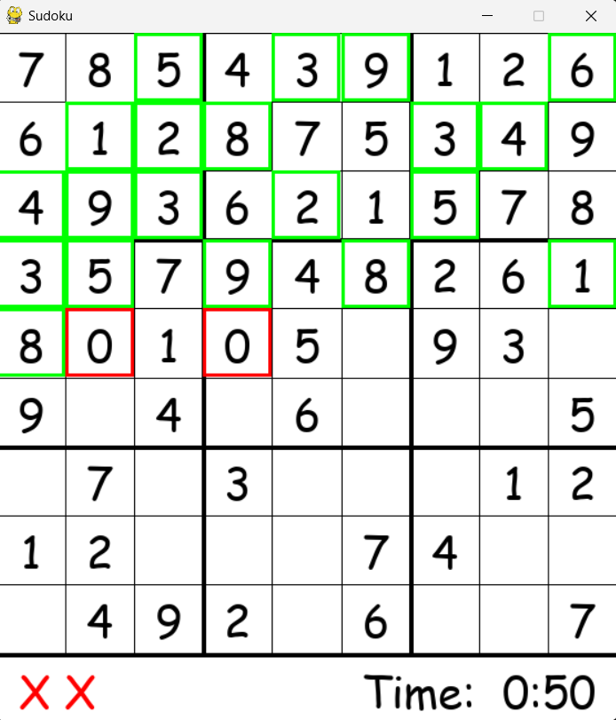

# Sudoku GUI game with real-time solver

#### A Sudoku Game with real time solver made using pygame in python
###### See also
[Ping Pong Online Multiplayer](https://github.com/ChauhanRohan-RC/Ping-Pong-AI.git)  
[3D N*N Rubik's Cube solver-AI](https://github.com/ChauhanRohan-RC/Cube.git)  
[Fourier Series Simulation](https://github.com/ChauhanRohan-RC/Fourier-Series.git)  

## Algorithm
* Uses a `Back Track` solving algorithm with real time solving progress visualizer
* Both Python and Java versions available

## Game Features
* Select cell: Use `L-Click` to select a cell on board
* Guess : enter a number from 1-9 in the selected cell
* Lock: Hit `Enter` to lock a guess
* Clear: Hit `Delete` to clear a guess
* Solve: Hit `Space` to auto solve the sudoku board in real time
* Timer and wrong moves count

## Usage
* Install python
* Clone project using  
`git clone https://github.com/ChauhanRohan-RC/Sudoku.git`
* Navigate to the project folder and run command  
`python Game.py`

## Connect on
[Twitter](https://twitter.com/0rc_studio)  
[YouTube](https://www.youtube.com/channel/UCmyvutGWtyBRva_jrZfyORA)  
[Google Play Store](https://play.google.com/store/apps/dev?id=7315303590538030232)  
E-mail: com.production.rc@gmail.com